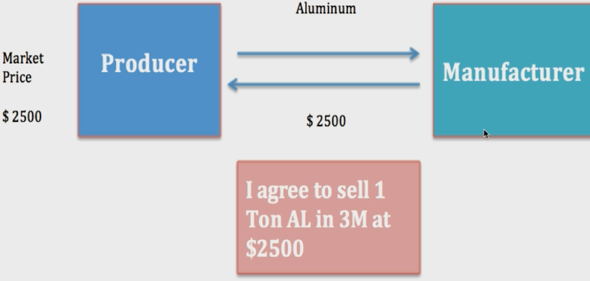
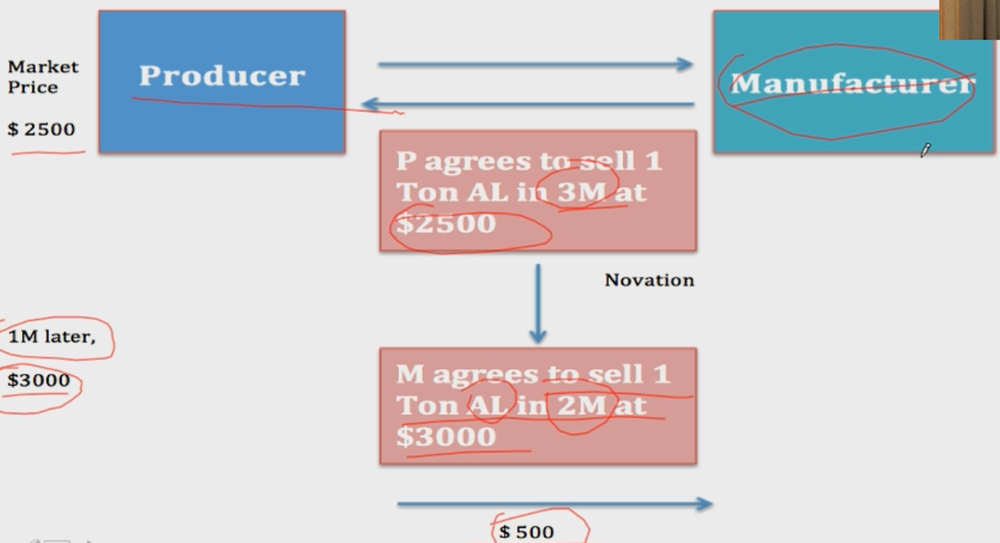
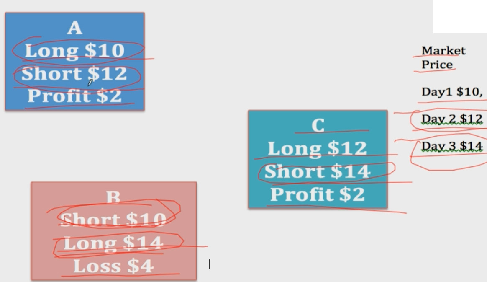
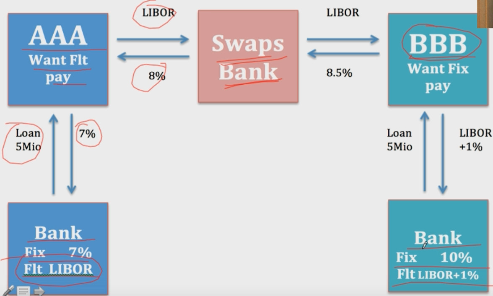

# Derivative

- [Derivative](#derivative)
  - [Call Option & Put Option](#call-option--put-option)
  - [Contract](#contract)
  - [Swap](#swap)

## Call Option & Put Option

看涨期权(Call Option)：在**expiry date**以**specified price**来**买入**某种资产(Underlying Asset)
> 低于strike price, 该期权worthless

看跌期权(Put Option): 在**expiry date**以**specified price**来**卖出**某种资产(Underlying Asset)
> 高于strike price, 该期权worthless

European Option & American Option
- European Option: 必须在expiry data那个时间点
- American Option: 可以在expiry date那个时间点及以前, 但是很少情况提前执行交割，所以价格比European Option贵

买入看涨期权(long Call Option, 对方交割Share)
> 
卖出看涨期权(short Call Option, 本方交割Share): 赌不超过strike price, 期权worthless, 挣期权费(Option Premium, Option Fee)
> 一般要求手里有可交割的实物(Covered Call)  
> 如果没有可交割的实物(Uncovered Call), 需要从市场上买入实物，然后交割，亏损可以无穷大  
> 

买入看跌期权(long Put Option, 对方交割Share)
> 

卖出看跌期权(short Put Option, 本方交割Share): 赌超过strike price, 期权worthless,为了挣期权费(Option Premium)
> 

## Contract

Forward Contract(远期合约) & Future Contract(期货) & Swap(互换)
- Forward Contract: 生产者、消费者之间交割，任意商品
- Future Contract: 交易所交割，特定的商品
- Swap

Forward Contract到期日交割- Cash Settlement
>   
>   
- Market Price>Forward Price: producer pays manufacturer money
- Market Price<Forward Price: manufacturer pays producer money

Future Contract(交易所期货)
>   

## Swap
>   
